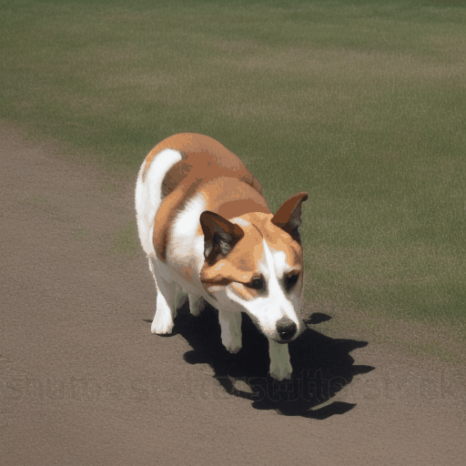
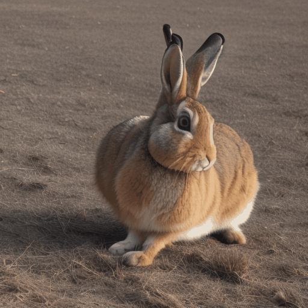
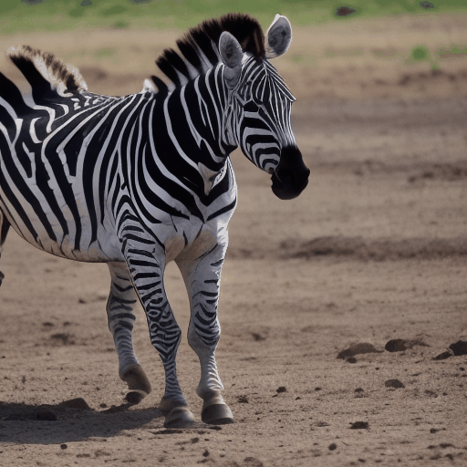
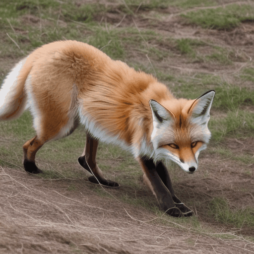

# SDI-Paste

[//]: # (## Gallery)
[//]: # (Here we demonstrate some examples of generated dynamic object instances.)

<table>
    <tr>
    <td></td>
    <td></td>
    <td></td>
    <td></td>
    <td></td>
    </tr>
</table>
<p style="margin-left: 2em; margin-top: -1em">Generated dynamic object instances using AnimateDiff: <a href="https://civitai.com/models/4201/realistic-vision-v20">Realistic Vision V2.0</a></p>


This repository is the official implementation of [SDI-Paste](https://arxiv.org/pdf/2410.13565) - a generative data augmentation regime for Video Instance Segmentation.


SDI-Paste works in two parts: 
    1. Generation of Synthetic Dynamic Object Instances 
    2. Foreground Segmentation of Dynamic Object Instances 
    2. Training of VIS Model

Instruction for each of the parts can be found in the README inside the corresponding folders.

Please cite our paper if this repository has been helpful for your research endeavours.

Happy coding!

## 1. Generate Dynamic Object Intances using AnimateDiff
This section is sourced from the official implementation of [AnimateDiff](https://github.com/guoyww/AnimateDiff) and has been modified for SDI-Paste. Please see the original repo if you wish to train/finetune AnimateDiff. For SDI-Paste, we will make use of pre-trained models only. Thank you to Gao _et al._ for their incredible work.

### Prepare Environment

[//]: # (***We updated our inference code with xformers and a sequential decoding trick. Now AnimateDiff takes only ~12GB VRAM to inference, and run on a single RTX3090 !!***)


[//]: # (git clone https://github.com/guoyww/AnimateDiff.git)
```
cd AnimateDiff 
conda env create -f environment.yaml
conda activate animatediff
pip install huggingface-hub==0.25.2
pip install numpy==1.26.0 
```
Install CLIP:
```
pip install ftfy regex tqdm
pip install git+https://github.com/openai/CLIP.git 
```

### Download Base T2I & Motion Module Checkpoints
There are two versions of Motion Modules provided by AnimateDiff, which are trained on stable-diffusion-v1-4 and finetuned on v1-5 seperately.
It's recommended to try both of them for best results.
```
git lfs install
git clone https://huggingface.co/runwayml/stable-diffusion-v1-5 models/StableDiffusion/

bash download_bashscripts/0-MotionModule.sh
```
You may also directly download the motion module checkpoints from [Google Drive](https://drive.google.com/drive/folders/1EqLC65eR1-W-sGD0Im7fkED6c8GkiNFI?usp=sharing) / [HuggingFace](https://huggingface.co/guoyww/animatediff) / [CivitAI](https://civitai.com/models/108836), then put them in `models/Motion_Module/` folder.

### Prepare Personalize T2I

[//]: # (Here we provide inference configs for 6 demo T2I on CivitAI.)

We use the 5-RealisticVision style T2I checkpoint to generate the most realistic-looking object instances.
You may run the following bash scripts to download the checkpoint.
```
bash download_bashscripts/5-RealisticVision.sh
```
Other styles are also available [See [AnimateDiff repo](https://github.com/guoyww/AnimateDiff)] 
```
bash download_bashscripts/1-ToonYou.sh
bash download_bashscripts/2-Lyriel.sh
bash download_bashscripts/3-RcnzCartoon.sh
bash download_bashscripts/4-MajicMix.sh
bash download_bashscripts/6-Tusun.sh
bash download_bashscripts/7-FilmVelvia.sh
bash download_bashscripts/8-GhibliBackground.sh
```

### Inference
After downloading the above peronalized T2I checkpoints, run the following commands to generate dynamic object instances. The results will automatically be saved to `samples/` folder where subfolders named according to the 40 class labels in VIS will be created. Please also set the number of scenes you want for each object category with `--num_scenes`.
```
python -m scripts.animate_sdipaste --config configs/prompts/5-RealisticVision.yaml --num_scenes 470
```

## 2. Extract foreground object instance using TokenCut 


## Acknowledgements
We leverage [AnimateDiff](https://github.com/guoyww/AnimateDiff) for video frames generation. Many thanks to Guo _et al._ for their great work and easy-to-use codebase!


